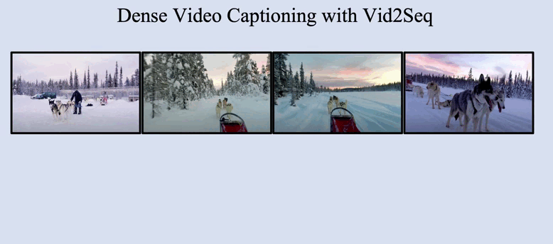

## Breaking language barriers, one word at a time with USM - the ultimate speech AI for over 100 languages. [^1]

Google's Universal Speech Model (USM) is a significant milestone towards achieving the company's 1,000 Languages Initiative, which aims to support the world's most spoken languages. USM is a family of state-of-the-art speech models trained on a vast dataset of 12 million hours of speech and 28 billion sentences of text, covering over 300 languages. What's impressive about USM is that it can recognize under-resourced languages like Amharic, Cebuano, Assamese, and Azerbaijani, among others, that are spoken by fewer than twenty million people. The key to USM's success is utilizing a large multilingual dataset to pre-train the encoder of the model and fine-tuning on a smaller set of labeled data. This approach allows the model to recognize under-represented languages and adapt to new languages and data effectively. With USM, Google is breaking language barriers and bringing greater inclusion to billions of people around the globe.

## Performing Real-World Navigation: Google's Performer-MPC Combines Transformers and Model Predictive Control for Safe and Efficient Robot Navigation. [^2]

Despite decades of research, robot navigation in human-centric environments remains a challenge. Google Research is exploring how advances in machine learning, specifically Transformers models, can enable robots to navigate through tight spaces while complying with social norms. However, the deployment of massive Transformer-based controllers on mobile robots can be challenging due to strict latency constraints. To address this issue, Google Research and Everyday Robots presented Performer-MPC, an end-to-end learnable robotic system that combines a differentiable model predictive controller, Transformer-based encodings, and scalable low-rank implicit-attention Transformers with linear space and time complexity attention modules. The result is an efficient on-robot deployment that allows robots to navigate tight spaces while demonstrating socially acceptable behaviors. The research presents a significant step towards enabling safe and efficient robot navigation in real-world environments.

## Baidu's Ernie Bot Showcases Multimodal Output Feature, Setting High Standards for Language Models in China. [^3]

Baidu, the Chinese search engine giant, has unveiled its latest large language model (LLM), called Ernie Bot, which features a multimodal output capability. Ernie Bot, which stands for "Enhanced Representation from kNowledge IntEgration," can solve math problems, write marketing copy, answer questions about Chinese literature, and generate multimedia responses. According to Baidu's CEO, Robin Li, Ernie Bot performs particularly well on tasks specific to Chinese culture, such as explaining historical facts or writing traditional poems.

The highlight of Ernie Bot's release is its multimodal output feature, which ChatGPT and OpenAI's recently announced GPT-4 do not offer. Ernie Bot can generate illustrations, read out text answers, and even edit and subtitle videos based on text inputs. However, there have been reports that some of the features showcased during the product launch, specifically the video generation, have failed to be reproduced in later testing. Despite this setback, Baidu's Ernie Bot is an exciting addition to the growing list of large language models and highlights the increasing emphasis on multimodal capabilities in AI language models.

## GPT-4. [^4]

We've technically already seen the release of GPT-4 more than 5 weeks ago. OpenAI says GPT-4 is 82% less likely to respond to requests for disallowed content and 40% more likely to produce factual responses than GPT-3.5 on our internal evaluations. GPT-4’s capability is impressive, from being able to produce the code for a hand-sketched website, to creating content that passed the completely human check of GPT Zero, and confusing OpenAI’s LLM text classifier. Unfortunately, due to security and competition reasons, OpenAI stated in their GPT-4 technical report that it contains no further details about the architecture , hardware, training compute, dataset construction, training method, or similar.GPT-4’s text-generation speed is significantly slower than the current free version of ChatGPT.

## Maximizing Collaboration and Productivity with Innovative Chat Plugins. [^5]

Chat plugins are computer programmes that enhance the usefulness of chat programmes by adding new features and functionalities. Some possible concepts for fresh chat plugins include translation, calendar reminders, polling, task management, screen sharing, voice and video calling, social media integration, personalization, and a knowledge base. Integrating additional tools and apps with the chat application is also made possible through the integration plugin. These plugins can help users collaborate more effectively and smoothly across various platforms.

## Vid2Seq: A Powerful Visual Language Model for Generating Video Descriptions. [^6]

Videos are an integral part of our daily lives and understanding their content has become increasingly important. Dense video captioning is a task that involves temporally localizing and describing all events in a minutes-long video. Current dense video captioning systems have several limitations such as being trained exclusively on manually annotated datasets and containing specialized task-specific components. However, a new architecture called "Vid2Seq" has been introduced which pre-trains a unified model by leveraging unlabeled narrated videos. This model improves the state of the art on a variety of dense video captioning benchmarks and also generalizes well to other related tasks. The code for Vid2Seq has also been made available for others to use.

[^1]: [https://ai.googleblog.com/2023/03/universal-speech-model-usm-state-of-art.html](https://ai.googleblog.com/2023/03/universal-speech-model-usm-state-of-art.html)

[^2]: [https://ai.googleblog.com/2023/03/performer-mpc-navigation-via-real-time.html](https://ai.googleblog.com/2023/03/performer-mpc-navigation-via-real-time.html)

[^3]: [https://www.technologyreview.com/2023/03/16/1069919/baidu-ernie-bot-chatgpt-launch/](https://www.technologyreview.com/2023/03/16/1069919/baidu-ernie-bot-chatgpt-launch/)

[^4]: [https://techstory.in/every-ai-product-launched-in-march-2023/](https://techstory.in/every-ai-product-launched-in-march-2023/)

[^5]: [https://platform.openai.com/docs/plugins/introduction](https://platform.openai.com/docs/plugins/introduction)

[^6]: [https://ai.googleblog.com/2023/03/vid2seq-pretrained-visual-language.html](https://ai.googleblog.com/2023/03/vid2seq-pretrained-visual-language.html)
