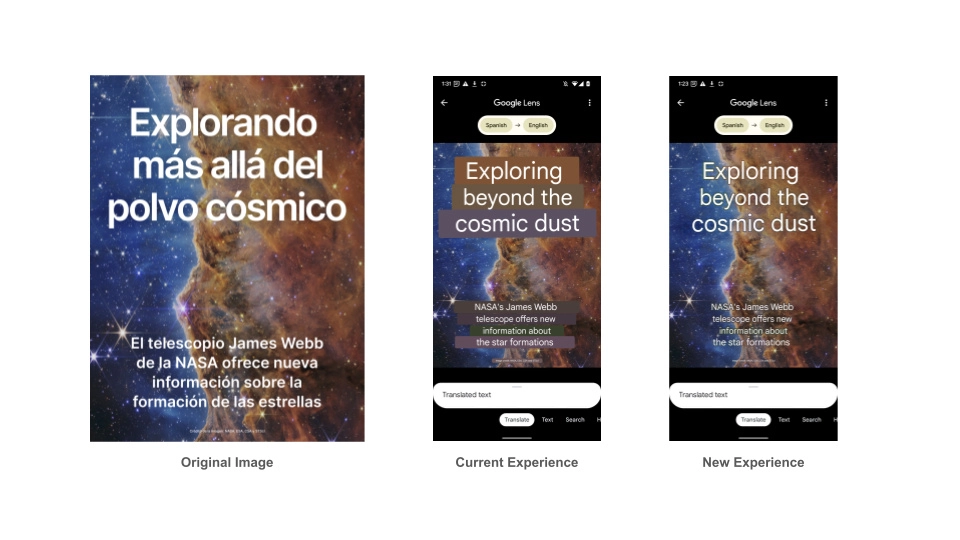
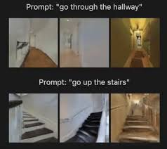
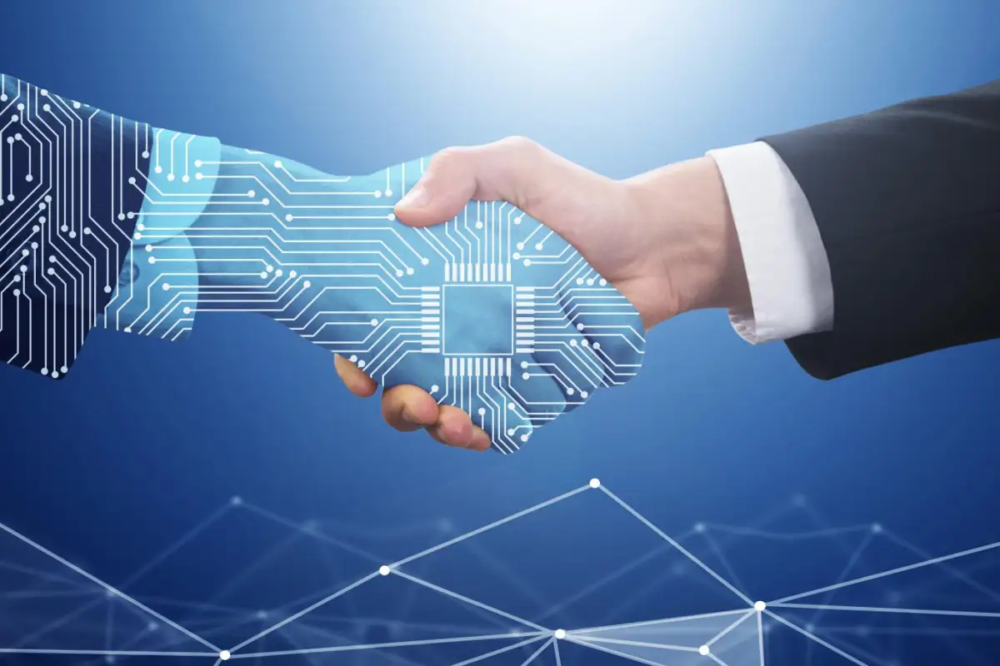

## AI Reduces a 100,000-Equation Quantum Physics Problem to 4 Equations [^1]

Physicists have compressed a daunting quantum problem that required 100,000 equations into just four. Breakthrough could help scientists better understand the behavior of electrons in materials. Machine learning tool could also be used in other fields, such as cosmology and neuroscience.

Physicists have compressed a daunting quantum problem that required 100,000 equations into just four using AI.  The renormalization group is a jumbo-size set of equations that must be solved. Di Sante and his colleagues used a machine learning program which captured the Hubbard model's physics with just four equations. 

This breakthrough could help scientists better understand the behavior of electrons in materials, which could lead to new technologies.  There are also exciting possibilities for using the technique in other fields that deal with renormalization groups, such as cosmology and neuroscience.

## Google Lens & Text To Speech gets major upgrades [^2] [^3]

Google has annonced that they have updated all 421 voices in 67 languages with a new voice model and synthesizer. This update is available for all 64bit Android Devices by updating/installing the Speech Services by Google app. 

The model is built using fresher speaker data, which alongside new stack, results in a drastic improvement in speech synthesis. 

Google showed off a new feature for Google Lens, which uses ML and augmented reality (ar) to deliver a more seamless real-time translation experience. The new Lens AR Translate experience doesn't show any bars on the original image. It utilizes machine learning to erase the original text, recreate the pixels underneath with an AI-generated background, and then overlay the translated text. The feature will be available in 59 languages.

The company claims the experience will roll out later this year. Google uses the same technology that powers the Magic Eraser feature on Pixel devices to do this.

## Lyra V2 - a better, faster, and more versatile speech codec [^4]

Lyra is a open-source speech codec that Google developed to improve the quality of speech recognition. 

Lyra V2 is faster, efficient, versatile and is designed to be used in low-power devices, such as smart speakers and mobile phones. It is based on E2E neural audio codec called SoundStream. It offers scalable bitrate capabilities, better performance, and generates higher quality audio.

## GAUDI: A Neural Architect for Immersive 3D Scene Generation [^5]

GAUDI is a neural architecture that can generate realistic 3D scenes from a single image designed to be used in VR. It's generative model capable of capturing the distribution of complex and realistic 3D scenes that can be rendered immersively from a moving camera.

GAUDI obtains state-of-the-art performance in the unconditional generative setting across multiple datasets.

## Meta's Make-A-Video: An AI system that generates videos from text [^6]

Make-A-Video is a new AI system that can generate videos from text prompts. It's designed to be used in virtual reality, and it can generate realistic 3D scenes from a single image. It's also designed to be used in virtual reality, and it can generate realistic 3D scenes from a single image.

The system learns what the world looks like from paired text-image data. It can also create videos from images or take existing videos and create new ones that are similar.

Make-A-Video follows Meta's announcement earlier of [Make-A-Scene]( "Make-A-Scene")

## NVIDIA DLSS 3: Higher FPS using AI [^7]

NVIDIA DLSS revolutionized graphics by using AI super resolution and Tensor Cores on GeForce RTX GPUs to boost frame rates while delivering crisp, high quality images that rival native resolution. 

DLSS 3 is a revolutionary breakthrough in AI-powered graphics that massively boosts performance, while maintaining great image quality and responsiveness. Building upon DLSS Super Resolution, DLSS 3 adds Optical Multi Frame Generation to generate entirely new frames, and integrates NVIDIA Reflex low latency technology for optimal responsiveness. It can lead upto 4x performace over brute-force rendering.

## PyTorch Foundation: A new era for the cutting-edge AI framework [^8]

PyTorch is moving to a new, independent PyTorch Foundation, under the Linux Foundation umbrella. PyTorch was built with an open source, community-first philosophy, and that will not change. The foundation's mission is to drive adoption of AI tooling by fostering and sustaining an ecosystem of open source projects. It will democratize state-of-the-art tools, libraries, and other components to make these innovations accessible to everyone.

PyTorch was created by a group of Meta AI researchers to fix the tedious, complicated pipeline of the AI field. Meta will continue to invest in the framework, and use it as the primary framework for our AI research and production. The framework will continue to be a part of Meta's AI research and engineering work.

## The EU wants to put companies on the hook for harmful AI [^9]

The EU is creating new rules to make it easier to sue AI companies for harm. A bill unveiled this week is likely to become law in a couple of years. The bill would give people and companies the right to sue for damages after being harmed by an AI system. It will add teeth to the EU's AI Act, which is set to become law around the same time.

The EU wants to be the global gold standard for AI regulation. Other countries, such as the US, are considering similar regulations. The Federal Trade Commission is considering rules around how companies handle data and build algorithms. It has forced companies that have collected data illegally to delete their algorithms.

[^1]:  [https://www.simonsfoundation.org/2022/09/26/artificial-intelligence-reduces-a-100000-equation-quantum-physics-problem-to-only-four-equations/](https://www.simonsfoundation.org/2022/09/26/artificial-intelligence-reduces-a-100000-equation-quantum-physics-problem-to-only-four-equations/)
[^2]:  [https://android-developers.googleblog.com/2022/09/listen-to-our-major-text-to-speech-upgrades-for-64-bit-devices.html?m=1](https://android-developers.googleblog.com/2022/09/listen-to-our-major-text-to-speech-upgrades-for-64-bit-devices.html?m=1)
[^3]:  [https://www.xda-developers.com/google-lens-ar-translate/](https://www.xda-developers.com/google-lens-ar-translate/)
[^4]:  [https://opensource.googleblog.com/2022/09/lyra-v2-a-better-faster-and-more-versatile-speech-codec.html](https://opensource.googleblog.com/2022/09/lyra-v2-a-better-faster-and-more-versatile-speech-codec.html)
[^5]:  [https://machinelearning.apple.com/research/gaudi](https://machinelearning.apple.com/research/gaudi)
[^6]:  [https://ai.facebook.com/blog/generative-ai-text-to-video/](https://ai.facebook.com/blog/generative-ai-text-to-video/)
[^7]:  [https://www.nvidia.com/en-us/geforce/news/dlss3-ai-powered-neural-graphics-innovations/](https://www.nvidia.com/en-us/geforce/news/dlss3-ai-powered-neural-graphics-innovations/)
[^8]:  [https://ai.facebook.com/blog/pytorch-foundation/](https://ai.facebook.com/blog/pytorch-foundation/)
[^9]:  [https://www.technologyreview.com/2022/10/01/1060539/eu-tech-policy-harmful-ai-liability/](https://www.technologyreview.com/2022/10/01/1060539/eu-tech-policy-harmful-ai-liability/) 
